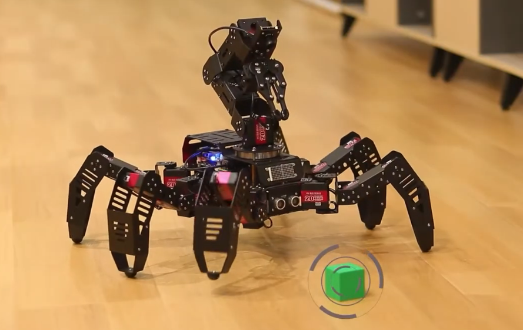

# SpiderPi Pro

[English](https://github.com/Hiwonder/SpiderPi-Pro/blob/main/README.md) | 中文

<p align="center">
  
</p>

基于树莓派的AI视觉六足机器人套件，集成视觉机械臂，支持物品识别抓取、智能分拣、多台群控等高级AI应用。

## 产品介绍

幻尔SpiderPi Pro是一款基于树莓派5/树莓派4B开发的AI视觉六足机器人套件，它在原SpiderPi六足机器人的基础上，增加了一个视觉机械手臂，可以拓展出更多有趣的AI创意玩法，如物品识别抓取、运输搬运、智能分拣、多台群控等。它不仅能满足用户对机器视觉、六足步态和机械臂运动学的学习和验证，还为传感器应用、视觉抓取等二次开发提供快速、便捷的集成方案。

## 官方资源

### Hiwonder官方
- **官方网站**: [https://www.hiwonder.net/](https://www.hiwonder.net/)
- **产品页面**: [https://www.hiwonder.com/products/spiderpi-pro](https://www.hiwonder.com/products/spiderpi-pro)
- **官方文档**: [https://docs.hiwonder.com/projects/SpiderPi_Pro/en/latest/](https://docs.hiwonder.com/projects/SpiderPi_Pro/en/latest/)
- **技术支持**: support@hiwonder.com

## 主要功能

### AI视觉功能
- **颜色识别** - 先进的颜色识别和追踪
- **颜色追踪** - 实时基于颜色的目标追踪
- **人脸检测** - 全面的人脸识别能力
- **AprilTag检测** - 精确的标签识别用于导航
- **视觉巡航** - 智能视觉监控和巡视
- **物品识别** - AI驱动的物体识别

### 高级应用
- **智能抓取** - 自主物品识别和抓取
- **积木抓取** - 精确的积木操作和取回
- **颜色分拣** - 基于颜色的自动化物品分拣
- **形状识别** - 几何形状检测和分析
- **智能踢球** - 带视觉反馈的踢球功能
- **巡航搬运** - 自主导航和运输
- **球体定向** - 球体追踪和定位

### 运动控制
- **六足步态控制** - 先进的六足运动算法
- **机械臂运动学** - 机械臂逆运动学控制
- **动作组** - 预编程的动作序列
- **遥控功能** - 通过手柄和网络的无线控制
- **多机群控** - 多台机器人协同控制
- **自动避障** - 智能障碍物检测和避障

### 编程接口
- **Python编程** - 完整的Python SDK
- **RPC接口** - JSON-RPC远程调用
- **视频流** - 实时MJPG视频流传输
- **手柄支持** - 游戏控制器集成
- **开源平台** - 完整的开源平台支持定制化

## 硬件配置
- **处理器**: 树莓派5或树莓派4B
- **结构**: 六足机器人配备集成机械臂
- **舵机**: 高精度数字舵机
- **视觉系统**: 高清摄像头配云台机构
- **传感器**: 超声波传感器、摄像头
- **通信**: WiFi、蓝牙

## 项目结构

```
spiderpi_pro/
├── SpiderPi.py               # 主程序入口
├── rpc_server.py            # RPC服务器
├── mjpg_Server.py           # 视频流服务器
├── joystick.py              # 手柄控制
├── pick_action.py           # 抓取动作
├── action_group_dict.py     # 动作组定义
├── action_groups/           # 预编程动作序列
├── functions/               # 功能模块
│   ├── color_detect.py      # 颜色检测
│   ├── color_track.py       # 颜色追踪
│   ├── face_detect.py       # 人脸检测
│   ├── apriltag_detect.py   # AprilTag检测
│   ├── visual_patrol.py     # 视觉巡航
│   ├── avoidance.py         # 避障功能
│   ├── remote_control.py    # 遥控功能
│   ├── robot_dance.py       # 舞蹈表演
│   └── multi_control_*.py   # 多机群控
├── advanced/                # 高级应用
│   ├── intelligent_fetch.py # 智能抓取
│   ├── block_fetch.py       # 积木操作
│   ├── color_sorting.py     # 颜色分拣
│   ├── shape_recognition.py # 形状识别
│   ├── intelligent_kick.py  # 踢球功能
│   ├── cruise_carry.py      # 巡航搬运
│   └── ball_orientation.py  # 球体定向
├── kinematic_routines/      # 运动学算法
├── spiderpi_sdk/           # 硬件控制SDK
├── config/                 # 配置文件
└── sources/                # 资源和文档
```

## 版本信息
- **当前版本**: SpiderPi Pro v1.0.0
- **支持平台**: 树莓派5、树莓派4B

### 相关技术
- [OpenCV](https://opencv.org/) - 计算机视觉库
- [Python](https://www.python.org/) - 编程语言

---

**注**: 所有程序已预装在SpiderPi Pro机器人系统中，可直接运行。详细使用教程请参考[官方文档](https://docs.hiwonder.com/projects/SpiderPi_Pro/en/latest/)。
